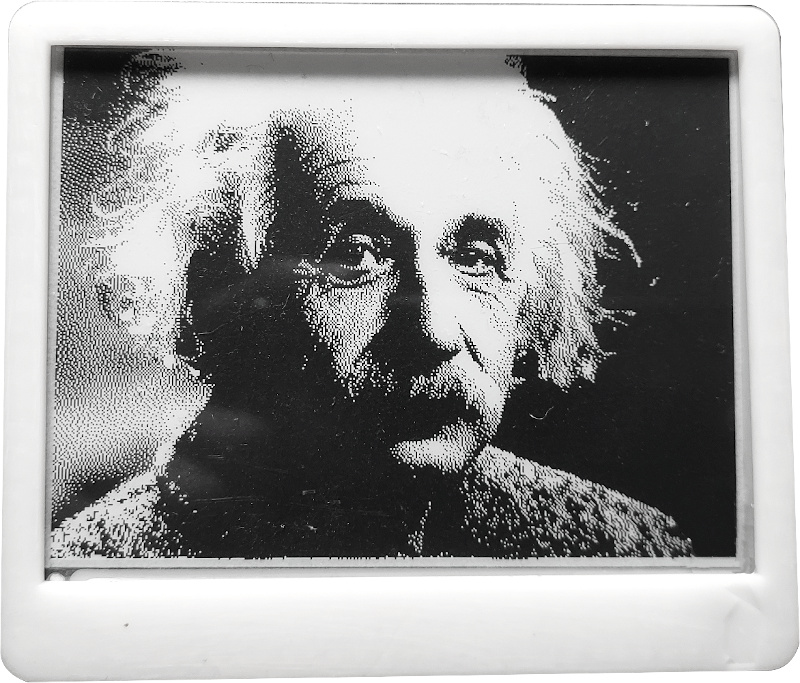

# Minimal example using GxEPD

## Install Library Dependencies (from arduino library manager)
  - Adafruit GFX library by Adafruit (tested with v1.7.5)
  - GxEPD by Jean-Marc Zingg version (tested with v3.0.9)

## Usage
Upload sketch and you should see Albert Einstein
